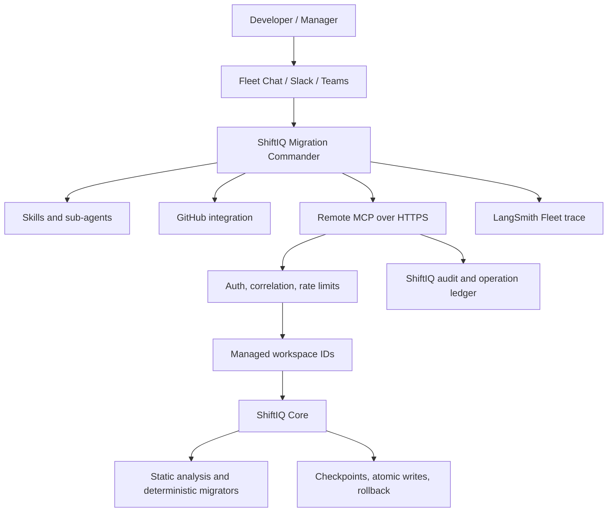

# Architecture

Fleet decides what work should happen. ShiftIQ decides how migrations safely happen. Agent reasoning cannot override dry-run defaults, managed roots, redaction, stale-revision checks, checkpoint-before-write, atomic writes, or idempotency.

Remote callers see a UUID `workspace_id`, repository/ref/SHA metadata, relative filenames, and structured results. Absolute host paths never appear in remote tool schemas.
